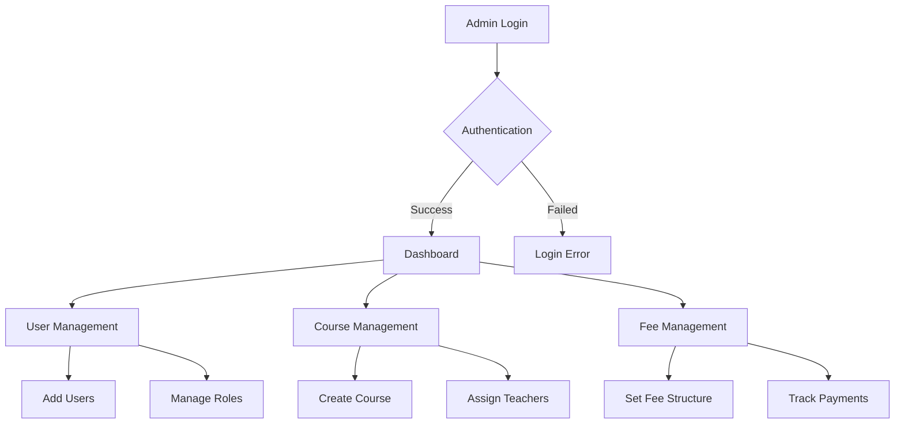
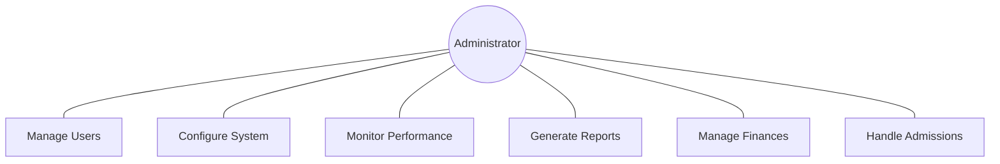
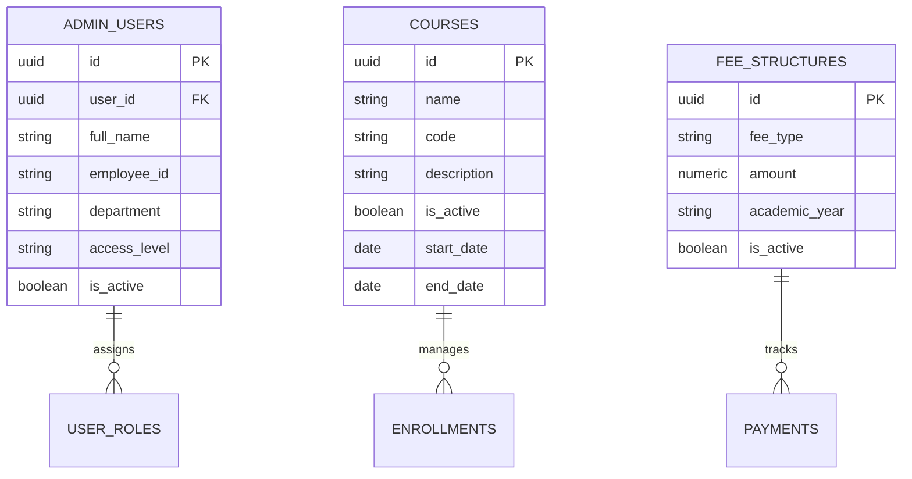

# Administrator Module Documentation

## Table of Contents
1. [Scope of System](#scope-of-system)
2. [Operating Environment](#operating-environment)
3. [Technology Stack](#technology-stack)
4. [System Design](#system-design)
5. [Testing](#testing)

## Scope of System
The Administrator Module manages institutional operations, including:
- Student and teacher management
- Course and curriculum planning
- Fee management
- Resource allocation
- Performance monitoring
- System configuration
- Report generation

## Operating Environment

### Hardware Requirements
- **Server-side:**
  - Dedicated server with redundancy
  - Minimum 16GB RAM
  - RAID storage configuration
  - High-speed internet connection

### Software Requirements
- Database management system
- Backup and recovery tools
- Analytics and reporting tools
- Security monitoring software

## System Design

### Workflow Diagram

### Use Case Diagram

### Entity Relationship Diagram

## Functional Requirements
1. **User Management**
   - Create and manage user accounts
   - Assign roles and permissions
   - Monitor user activities
   - Handle access control

2. **Academic Management**
   - Manage courses and programs
   - Schedule classes
   - Track performance
   - Generate reports

3. **Financial Management**
   - Set fee structures
   - Track payments
   - Generate invoices
   - Manage expenses

## Non-Functional Requirements
1. **Performance**
   - High availability (99.9% uptime)
   - Scalable architecture
   - Fast data processing

2. **Security**
   - Role-based access control
   - Data encryption
   - Audit logging
   - Regular backups

3. **Compliance**
   - Data protection regulations
   - Educational standards
   - Financial regulations

## Testing

### Test Cases

#### User Management
| Test ID | Description | Steps | Expected Result |
|---------|-------------|-------|-----------------|
| ADM_01 | Create user | 1. Enter details 2. Assign role | User created |
| ADM_02 | Modify permissions | 1. Select user 2. Update access | Permissions updated |
| ADM_03 | Deactivate account | 1. Select user 2. Confirm | Account deactivated |

#### Financial Management
| Test ID | Description | Steps | Expected Result |
|---------|-------------|-------|-----------------|
| FIN_01 | Set fee structure | 1. Define amounts 2. Save | Structure updated |
| FIN_02 | Process payment | 1. Enter details 2. Confirm | Payment recorded |

## Limitations
1. Limited integration options
2. Basic analytics capabilities
3. Manual backup process

## Future Enhancements
1. Advanced analytics dashboard
2. Automated backup system
3. Mobile administration app
4. Enhanced reporting tools
5. AI-powered insights
6. Blockchain certificates
7. Enhanced security features
