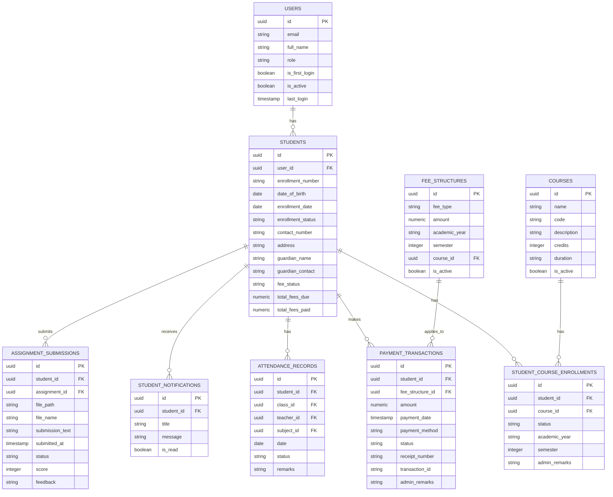

# Student Management System Documentation

This file contains comprehensive documentation for the Student Management System. For detailed information about each section, please refer to the full documentation sections below:

## Table of Contents
1. [Scope of System](#scope-of-system)
2. [Operating Environment](#operating-environment)
3. [Technology Stack](#technology-stack)
4. [System Components](#system-components)
5. [Database Design](#database-design)
6. [API Documentation](#api-documentation)
7. [Testing Strategy](#testing-strategy)

## Scope of System
[Content as provided in the documentation...]

## Operating Environment
[Content as provided in the documentation...]

## Technology Stack
[Content as provided in the documentation...]

## Entity Relationship Diagram
The following represents the ER diagram in traditional notation style:

Note: For clarity and simplicity, this diagram focuses on the core student-related entities and their relationships. Additional entities and relationships exist in the complete system.

## API Documentation
[Content as provided in the documentation...]

## Testing Strategy
[Content as provided in the documentation...]

For complete implementation details, please refer to the individual component documentation and codebase.
