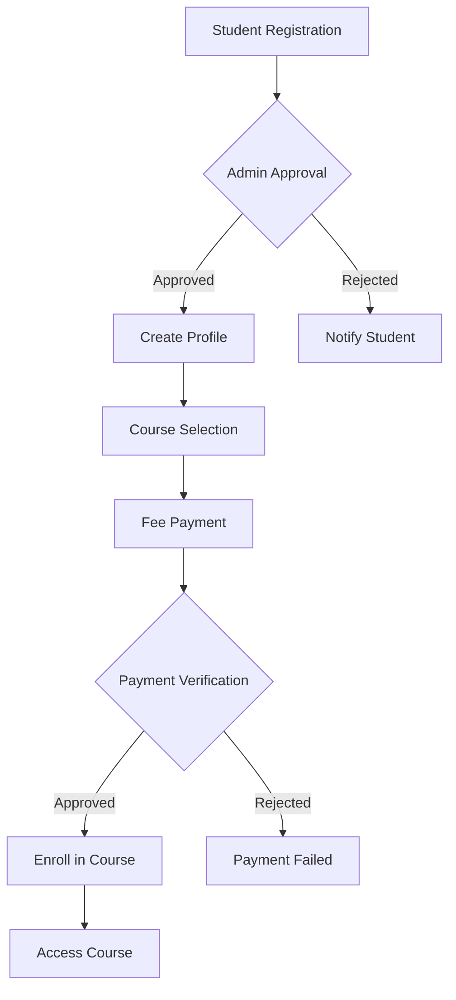
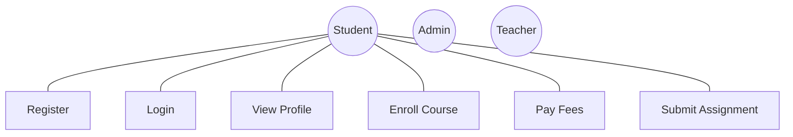
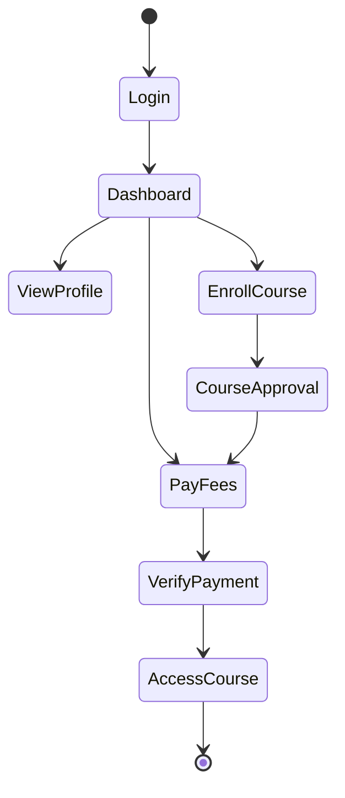
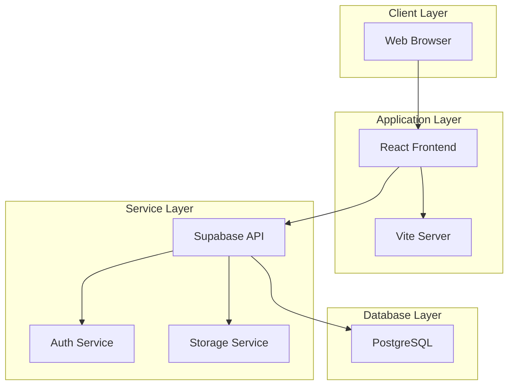
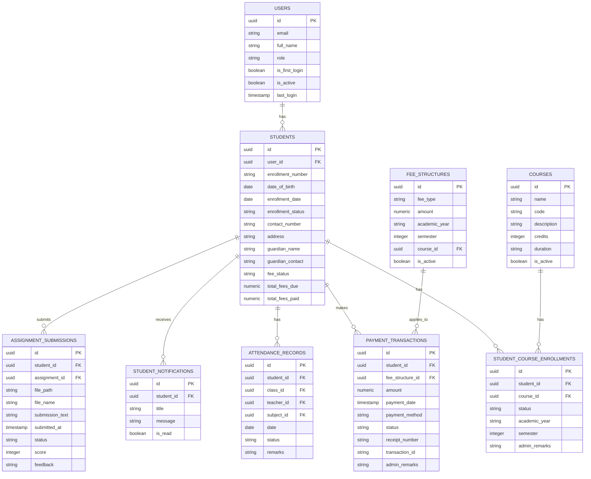

# Student Management System Documentation

This documentation provides a comprehensive overview of the Student Management System, detailing its architecture, components, and functionalities.

## Table of Contents
1. [Scope of System](#scope-of-system)
2. [Operating Environment](#operating-environment)
3. [Technology Stack](#technology-stack)
4. [Proposed System](#proposed-system)
5. [System Requirements](#system-requirements)
6. [System Design](#system-design)
7. [Database Design](#database-design)
8. [Testing](#testing)
9. [Limitations and Enhancements](#limitations-and-enhancements)

## Scope of System
The Student Management System (SMS) is designed to handle all aspects of student administration in an educational institution, including:
- Student enrollment and registration
- Course management and enrollment
- Fee management and payment tracking
- Attendance monitoring
- Academic performance tracking
- Communication management
- Document management
- Reporting and analytics

## Operating Environment

### Hardware Requirements
- **Client-side:**
  - Modern computer/laptop/tablet with internet connectivity
  - Minimum 4GB RAM
  - Display resolution: 1280x720 or higher
  
- **Server-side:**
  - Supabase cloud infrastructure
  - Minimum 8GB RAM recommended
  - Scalable storage based on needs

### Software Requirements
- **Client-side:**
  - Modern web browsers (Chrome 89+, Firefox 87+, Safari 14+, Edge 89+)
  - JavaScript enabled
  - Cookies enabled
  
- **Backend Infrastructure:**
  - Supabase platform
  - PostgreSQL database
  - Node.js runtime environment
  - RESTful API support

## Technology Stack
### Frontend
- React 18.3+ with TypeScript
- Vite for build tooling
- Tailwind CSS for styling
- Shadcn UI components
- React Query for data management
- React Router for navigation
- Recharts for data visualization

### Backend (Supabase)
- PostgreSQL database
- Row Level Security (RLS)
- Real-time subscriptions
- Authentication system
- Storage system

## Proposed System

### Solution Overview
The system implements a modern web-based solution that provides:
- Real-time data processing
- Responsive design for all devices
- Secure authentication and authorization
- Automated workflows for common tasks
- Comprehensive reporting system

### Objectives
1. Streamline student administration processes
2. Reduce manual paperwork
3. Improve data accuracy and accessibility
4. Enhance communication between stakeholders
5. Provide real-time analytics and reporting
6. Ensure data security and privacy
7. Support scalable operations

### Users of System
1. **Students**
   - Access personal information
   - View and enroll in courses
   - Track attendance and performance
   - Make fee payments
   - Submit assignments
   - Access study materials

2. **Administrators**
   - Manage student records
   - Process admissions
   - Handle fee management
   - Generate reports
   - Configure system settings

3. **Faculty**
   - Mark attendance
   - Grade assignments
   - Upload study materials
   - View student performance
   - Communicate with students

## System Design

### Workflow Diagram

### Use Case Diagram

### Activity Diagram

### Deployment Diagram

### Entity Relationship Diagram

## System Requirements

### Functional Requirements

1. **User Management**
   - Student registration and profile management
   - Authentication and authorization
   - Password management
   - Profile updates

2. **Course Management**
   - Course enrollment
   - Course catalog
   - Academic calendar
   - Class schedules

3. **Fee Management**
   - Fee structure configuration
   - Payment processing
   - Receipt generation
   - Payment history

4. **Academic Management**
   - Attendance tracking
   - Assignment submission
   - Grade management
   - Performance reports

### Non-Functional Requirements

1. **Performance**
   - Page load time < 3 seconds
   - Support for 1000+ concurrent users
   - Database response time < 2 seconds

2. **Security**
   - Encrypted data transmission
   - Role-based access control
   - Password policies
   - Session management

3. **Reliability**
   - 99.9% uptime
   - Data backup
   - Error handling
   - System logs

4. **Usability**
   - Responsive design
   - Intuitive interface
   - Help documentation
   - Multi-language support

## Testing

### Test Plan
1. **Unit Testing**
   - Component tests
   - Function tests
   - State management tests

2. **Integration Testing**
   - API integration
   - Database operations
   - Authentication flows

3. **System Testing**
   - End-to-end workflows
   - Performance testing
   - Security testing

4. **User Acceptance Testing**
   - Stakeholder review
   - Feature validation
   - User experience assessment

### Test Cases

#### Student Registration
| Test ID | Description | Steps | Expected Result |
|---------|-------------|-------|-----------------|
| REG_01 | Valid registration | 1. Fill form 2. Submit | Account created |
| REG_02 | Invalid email | 1. Enter invalid email 2. Submit | Error shown |
| REG_03 | Duplicate email | 1. Use existing email 2. Submit | Error shown |

#### Fee Payment
| Test ID | Description | Steps | Expected Result |
|---------|-------------|-------|-----------------|
| PAY_01 | Successful payment | 1. Enter amount 2. Select method 3. Pay | Payment recorded |
| PAY_02 | Invalid amount | 1. Enter negative amount 2. Submit | Error shown |
| PAY_03 | Payment verification | 1. Make payment 2. Admin verify | Status updated |

## Limitations and Enhancements

### Current Limitations
1. No offline mode
2. Limited payment gateway integration
3. Basic reporting capabilities
4. No mobile application
5. Limited data analytics

### Proposed Enhancements
1. Develop mobile application
2. Implement offline mode
3. Add advanced analytics
4. Integrate payment gateways
5. Enhance reporting system
6. Add AI-powered features
7. Implement blockchain certificates
8. Add biometric authentication
9. Enhance notification system
10. Add learning management features

