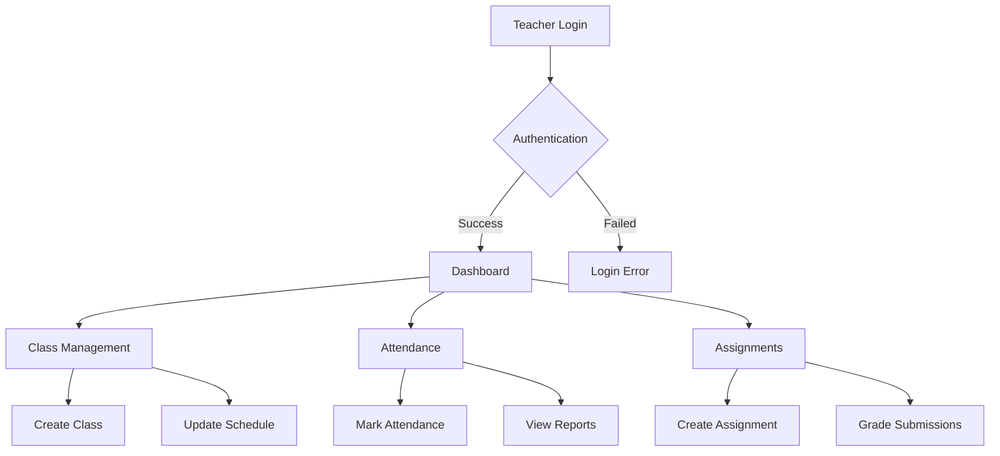
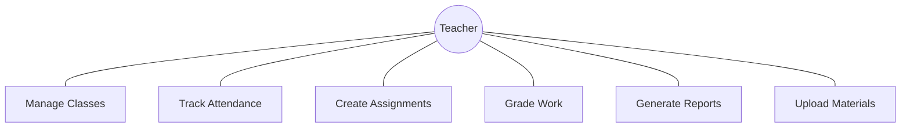
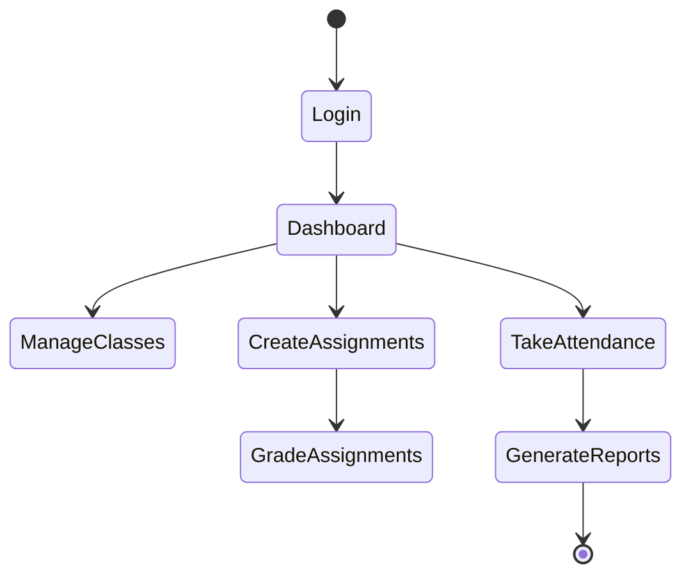
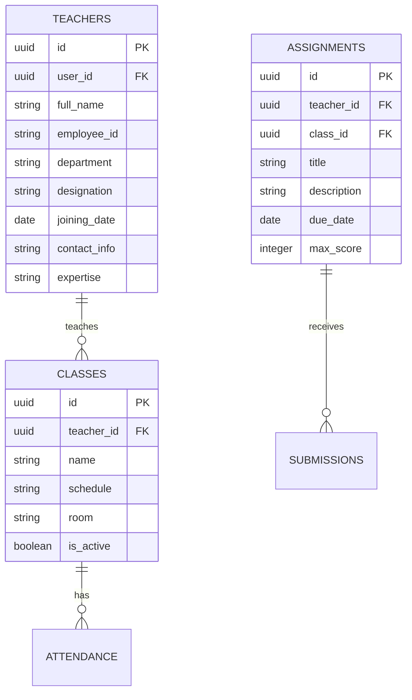

# Teacher Module Documentation

## Table of Contents
1. [Scope of System](#scope-of-system)
2. [Operating Environment](#operating-environment)
3. [Technology Stack](#technology-stack)
4. [System Design](#system-design)
5. [Testing](#testing)

## Scope of System
The Teacher Module manages all aspects of teacher interactions within the educational institution, including:
- Class management and scheduling
- Attendance tracking
- Assignment creation and grading
- Performance tracking
- Student communication
- Study material management
- Report generation

## Operating Environment

### Hardware Requirements
- **Client-side:**
  - Modern computer/laptop with internet connectivity
  - Minimum 4GB RAM
  - Webcam for virtual classes
  - Display resolution: 1280x720 or higher

### Software Requirements
- Modern web browsers (Chrome 89+, Firefox 87+, Safari 14+)
- PDF viewer for reports
- Video conferencing capabilities

## System Design

### Workflow Diagram

### Use Case Diagram

### Activity Diagram

### Entity Relationship Diagram

## Functional Requirements
1. **Class Management**
   - Create and update class schedules
   - Manage student rosters
   - Track attendance
   - Assign coursework

2. **Assessment Management**
   - Create assignments and tests
   - Grade submissions
   - Provide feedback
   - Generate performance reports

3. **Communication**
   - Send announcements
   - Respond to student queries
   - Share study materials
   - Schedule consultations

## Non-Functional Requirements
1. **Performance**
   - Page load time < 2 seconds
   - Support for concurrent users
   - Quick response time

2. **Security**
   - Secure access to student data
   - Protected grading system
   - Audit trail for changes

3. **Usability**
   - Intuitive interface
   - Mobile responsiveness
   - Offline capabilities
   - Accessibility features

## Testing

### Test Cases

#### Class Management
| Test ID | Description | Steps | Expected Result |
|---------|-------------|-------|-----------------|
| TCH_01 | Create new class | 1. Fill class details 2. Submit | Class created |
| TCH_02 | Update schedule | 1. Modify timing 2. Save | Schedule updated |
| TCH_03 | Mark attendance | 1. Select students 2. Submit | Attendance recorded |

#### Assignment Management
| Test ID | Description | Steps | Expected Result |
|---------|-------------|-------|-----------------|
| ASG_01 | Create assignment | 1. Add details 2. Set deadline | Assignment created |
| ASG_02 | Grade submission | 1. Review work 2. Assign score | Grades recorded |

## Limitations
1. Limited offline functionality
2. No integrated video conferencing
3. Basic reporting capabilities

## Future Enhancements
1. Advanced analytics dashboard
2. Integrated video classes
3. AI-powered grading assistance
4. Mobile application
5. Enhanced parent communication
